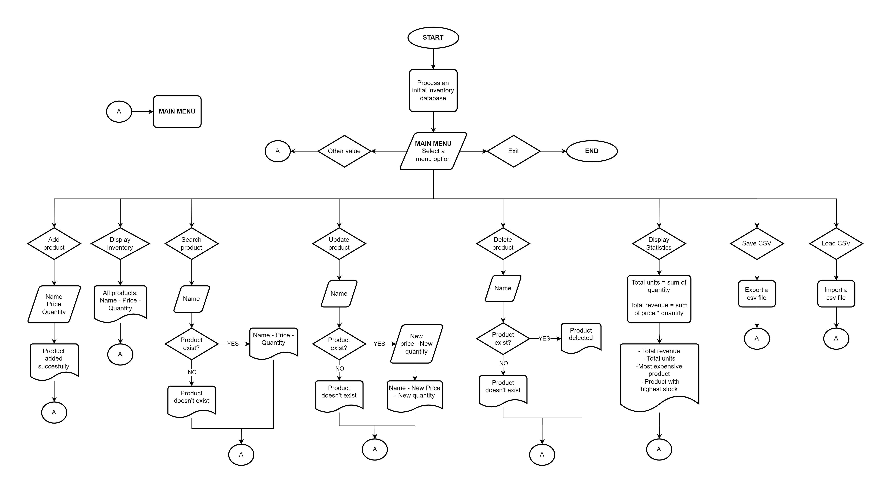

## J-PRODUCT SUPERMARKET INVENTORY SYSTEM Version M1S3

### ✅ Description

This project implements an Inventory Management System for a supermarket.

It allows users to add products, display inventory, search items, update or delete products, calculate statistics, and save/load data using CSV files.

The system is console-based and designed to work without external databases, using Python data structures such as lists and dictionaries.

### ✅ Flow diagram

### ✅ System architecture

The system follows a modular structure, where each Python file is responsible for a specific functionality:

+ main.py: Entry point of the program. Initializes inventory and starts the system.

+ interactive_menu.py: Displays the menu and handles user interaction and navigation.
  
+ add_product.py: Adds a new product to the inventory with validated input.

+ display_inventory.py: Shows all products in a formatted way.

+ search_product.py: Searches for a product by name.

+ update_product.py: Updates product price and/or quantity.

+ delete_product.py: Removes a product from the inventory.

+ display_statistics.py: Calculates total revenue, total quantity, and identifies top products.

+ input_validations.py: Handles validation for product name, price, and quantity.

+ save_csv_file.py: Saves the inventory into a CSV file.

+ load_csv_file.py: Loads inventory data from a CSV file with validation and merge/replace options.

### ✅ Instructions for running the program

Make sure Python is installed on your computer.
Open the project folder in VS Code or any editor.
Open a terminal in the project directory.
Run the program using:

    python main.py

Navigate the menu using the following options:

    1: Add product
    2: Display inventory
    3: Search product
    4: Update product
    5: Delete product
    6: Display statistics
    7: Save CSV
    8: Load CSV
    9: Exit

### ✅ Data structures used

#### Inventory Structure (List of Dictionaries)

The main data structure is a list of dictionaries:

inventory = [
    {"name": "Coffee", "price": 4200.0, "quantity": 2},
    {"name": "Apple", "price": 12500.0, "quantity": 1}
]

#### Dictionary (Product Structure)

Each product is stored as a dictionary:

+ name → product name (string) 
+ price → product price (float) 
+ quantity → stock quantity (integer)

#### CSV Management

The system uses CSV files to:

+ Persist data (save_csv) 
+ Load external data (load_csv) 
+ Validate structure (header, rows, data types)

### ✅ Description of the implement modules

**add_product.py:**

+ Adds a new product to inventory
+ Uses validation functions for safe input
+ Returns confirmation message

**display_inventory.py:**

+ Prints all products in a formatted way
+ Shows name, price, and quantity

**search_product.py:**

+ Searches a product by name
+ Returns product dictionary or None

**update_product.py:**

+ Updates price and/or quantity
+ Allows partial updates per product

**delete_product.py:**

+ Removes product from inventory
+ Uses loop + break + for-else logic

**display_statistics.py:**

Calculates:

+ Total revenue
+ Total quantity
+ Most expensive product
+ Product with highest stock

**input_validations.py:**

Validates:
+ Product name (letters only)
+ Price (float > 0)
+ Quantity (integer > 0)

**save_csv_file.py:**

+ Saves inventory to CSV
+ Uses csv.DictWriter
+ Handles file errors and permissions

**load_csv_file.py:**

Loads CSV data into inventory

Validates:

+ Header format
+ Data types
+ Positive values
  
Supports:

+ Replace inventory
+ Merge inventory